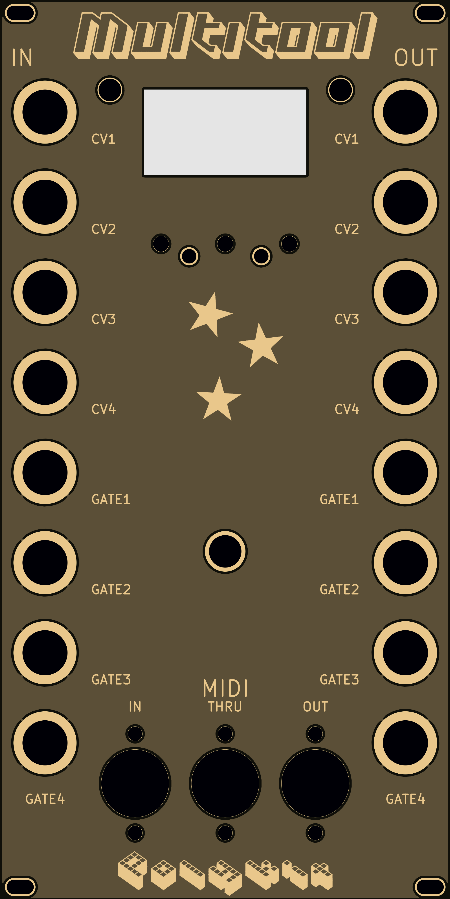
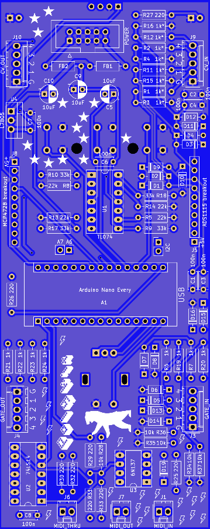

# Kosmo Multitool

This repository contains schematics, PCB and source code for a synthesizer module in Kosmo format. This module consists of an Arduino Nano Every, CV and gate input and output options, MIDI, rotary encoder and an OLED display. It is meant as a development platform for DIY synthesizer enthusiasts.

Here is a full list of features:
- 4x CV input (0-10V)
- 4x CV output (0-10V)
- 4x gate/trigger in
- 4x gate/trigger out
- 1.3" OLED display
- DIN serial MIDI in/through/out
- Rotary encoder with switch
- 3 switches
- 2 LEDs

 

## Modules

- Arpeggiator

## Building

Gerbers for the main PCB can be found [here](plots) and for the front panel [here](panel/plots).

### BOM

|Reference                                                  |Quantity|Value                |Comment                                           |
|-----------------------------------------------------------|--------|---------------------|--------------------------------------------------|
|A1                                                         |1       |Arduino Nano Every   |                                                  |
|C1 C2 C3 C4 C6 C7 C8                                       |7       |100n                 |                                                  |
|C5 C9 C10                                                  |3       |10uF                 |                                                  |
|D17 D18                                                    |2       |LED 5mm              |                                                  |
|D1 D2 D3 D4 D5 D6 D7 D8 D9 D10 D11 D12 D13 D14 D15 D16 D19 |17      |1N4148               |                                                  |
|FB1 FB2                                                    |2       |Ferrite Bead         |                                                  |
|J1                                                         |1       |MIDI_IN              |Molex KK 2.54mm 2 pin                             |
|J10                                                        |1       |CV_OUT               |Molex KK 2.54mm 5 pin                             |
|J2                                                         |1       |Display I2C          |OLED display 1.3" 128x64 I2C SH1106               |
|J3                                                         |1       |GATE_IN              |Molex KK 2.54mm 5 pin                             |
|J4                                                         |1       |GATE_OUT             |Molex KK 2.54mm 5 pin                             |
|J5                                                         |1       |ADS1115 breakout     |ADC, pin order: VCC GND SCL SDA ADDR ALERT A B C D|
|J6                                                         |1       |MIDI_THRU            |Molex KK 2.54mm 2 pin                             |
|J7                                                         |1       |MIDI_OUT             |Molex KK 2.54mm 2 pin                             |
|J8                                                         |1       |MCP4728 breakout     |DAC, pin order: VCC GND SCL SDA LDAC READY A B C D|
|J9                                                         |1       |CV_IN                |Molex KK 2.54mm 5 pin                             |
|POWER1                                                     |1       |POWER                |IDC 10 pin                                        |
|R1 R2 R3 R4 R11 R12 R15 R16                                |8       |1k*                  |                                                  |
|R5 R8 R13 R14                                              |4       |22k                  |                                                  |
|R9 R10 R17 R18                                             |4       |33k                  |                                                  |
|R25 R26 R27 R29 R30 R31 R32 R33                            |8       |220                  |                                                  |
|R28 R34 R35 R36 R37                                        |5       |10k                  |                                                  |
|R6 R7 R19 R20 R21 R22 R23 R24                              |8       |1k                   |                                                  |
|SW1 SW2 SW3                                                |3       |SW_Push              |Tactile Push Button 6x6x15mm                      |
|SW4                                                        |1       |Rotary_Encoder_Switch|Rotary encoder with switch, 20mm                  |
|U1                                                         |1       |TL074                |                                                  |
|U2                                                         |1       |74LS14               |                                                  |
|U3                                                         |1       |6N137                |                                                  |
|U4                                                         |1       |L7805                |                                                  |
|                                                           |        |Pin sockets, 2.54mm  |Needed for the Arduino, OLED display, ADC and DAC |
|                                                           |16      |Jack sockets 6.35mm  |                                                  |
|                                                           |3       |DIN MIDI sockets     |                                                  |

\* match in pairs to get more accurate ADC readings

## Installation and calibration

Clone the repository and open up the `src/main` folder in the Arduino IDE or whatever you use for compiling. You need to install the libraries mentioned below into you Arduino library folder. The ADC and the DAC need calibration to get proper results.

### ADC calibration
Set `CALIBRATE_CV_IN` variable in main file to `1`. Apply a fixed, known voltage to CV1 input, eg. 5.000V. On USB serial console (9600 baud) you get the actual reading from the ADC. Calculate the correction factor `FIXED VOLTAGE / ACTUAL VOLTAGE`, eg. `5.000 / 4.9884 = 1.0023`. Enter the value in the CV_IN_CORRECTION array in the top lines of `main.ino`. Repeat this procedure for all CV inputs. In the end it should look something like this:
```
float CV_IN_CORRECTION[4] = {0.9995f, 0.9956f, 1.0013f, 1.0009f};
```
Notice the trailing `f` to tell the compiler that these are float values. Don't forget to set `CALIBRATE_CV_IN` back to `0`.

### DAC calibration
Make sure to calibrate the ADC first. Set `CALIBRATE_CV_OUT` variable in main file to `1`. Plug in patch cables from all four CV inputs to the CV outputs. Calibration is done automatically and stored in a look-up table. Set `CALIBRATE_CV_OUT` back to `0`. This step is only needed once, from now on calibration values are loaded from EEPROM on start up.

## Development

Source code is in `src/main`. If you want to develop your own module just copy the files `example_module.h` and `example_module.ino` and rename all functions and variables that are globally available. Include your header file in the `main.ino` file and add your entry to the main menu. Take a look at the already existing modules on how it works in general. If you created a nice module please file a pull request and I would be happy to merge it.

## Libraries

https://github.com/adafruit/Adafruit_MCP4728

https://github.com/adafruit/Adafruit_ADS1X15

https://github.com/olikraus/u8g2

https://github.com/FortySevenEffects/arduino_midi_library

https://github.com/neu-rah/ArduinoMenu

https://github.com/thomasfredericks/Bounce2

https://github.com/mathertel/RotaryEncoder

https://github.com/ivanseidel/LinkedList


## References

https://www.lookmumnocomputer.com/modular

https://www.ti.com/lit/ds/symlink/ads1115.pdf

http://ww1.microchip.com/downloads/en/devicedoc/22187e.pdf

## License

This work is licensed under a [Creative Commons Attribution-NonCommercial 4.0 International License](http://creativecommons.org/licenses/by-nc/4.0/).
